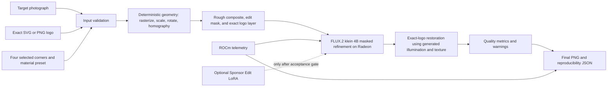

# Radeon SponsorSkin — Track 1 Delivery Plan

**Plan date:** 2026-07-30

**Hard submission deadline:** 2026-08-06 at 17:59 CEST

**Track:** Track 1 — Development of Multimodal Content Creation Tools

**Working repository:** `JaviChulvi/Radeon-hackathon-2026-07` (fork of the official contest repository)

**Planned submission directory:** `submissions/Track1-Radeon-SponsorSkin/`

## 1. Executive decision

Build **Radeon SponsorSkin**, a local image-editing tool that places an exact, user-supplied logo onto a selected surface and uses FLUX.2 [klein] on an AMD Radeon GPU to make the placement look physically integrated.

The winning product story is:

> Upload a photograph and an exact transparent logo, select the target surface, preview the deterministic placement, refine it locally on Radeon, and export a realistic sponsorship mockup without allowing the generative model to rewrite the brand.

The supplied project prompt is a strong product vision, but its full scope is too large for the remaining hackathon window. The submission should optimize for the judging rubric: a complete and useful workflow is worth 80 points, while Radeon execution is worth 20 points. A stable vertical slice with measured GPU evidence is more valuable than partially implementing six UI tabs, five media categories, a training platform, and 160 training pairs.

### Must ship

- A complete Gradio input → processing → output workflow.
- Target image upload.
- Transparent PNG and SVG logo upload and validation.
- Four-click quadrilateral placement.
- Optional painted/polygon mask if it does not endanger the core flow.
- Deterministic perspective warp and rough composite.
- Masked FLUX.2 [klein] refinement on Radeon/ROCm.
- Deterministic restoration of the exact logo after generative refinement.
- Original / rough composite / refined / final comparison.
- Fixed-seed generation and export metadata.
- Radeon device, ROCm, latency, and peak-memory evidence.
- At least three rights-cleared demo examples with visibly different surfaces.
- Reproducible README, project-profile PDF, 3–5 minute video, and poster.

### High-priority experiment, but not a release blocker

- A generic Sponsor Edit LoRA trained from paired rough-composite → polished-target examples.
- Base-versus-LoRA comparison using identical seeds.

The edit LoRA is allowed into the final product only if it trains and loads successfully on the Radeon environment and improves held-out examples. The scored end-to-end workflow must remain usable without it.

### Explicitly deferred

- Full or partial racing-livery generation.
- Five separately optimized object categories.
- SAM 2 or automatic segmentation.
- A second brand-style LoRA.
- A general-purpose Dataset Studio.
- A training dashboard with SQLite job orchestration.
- Multiple worker processes, cancellation, and resume UI.
- 100–160 production-quality training pairs.
- Automatic logo-variant selection.
- Embroidery as a guaranteed material mode.
- Video generation.

These are post-hackathon extensions, not MVP commitments.

## 2. Research findings that affect the plan

### Contest constraints

- The final deadline is **2026-08-06 at 17:59 CEST**.
- Track 1 requires a practical multimodal creation tool on an AMD Radeon GPU from Radeon Cloud using ROCm.
- At least one key inference stage must run locally on Radeon; the core feature cannot rely only on a closed online API.
- The tool may be a Web UI, desktop app, plugin, or CLI workflow.
- Scoring is:
  - Complete input-processing-output workflow: 40 points.
  - Innovative creation scenario: 20 points.
  - Practical/social value: 20 points.
  - Clear, stable, diverse Radeon outputs: 20 points.
- The submission and pull request must be in English.
- Luma registration approval and AMD Developer Program membership are mandatory for prize eligibility.
- Teams may contain up to three registered members using the same team name.
- The required package is a project-profile PDF, complete source and README, a 3–5 minute demo, and either a PPT or poster.
- Submission is made through a fork and pull request to the official contest repository.

### Repository state

- The current fork is clean and still contains only the official contest README and Radeon Cloud guide.
- The official guide explains persistent storage, Jupyter/SSH access, and public tunneling, but it does not contractually specify the GPU SKU, VRAM, or container memory for every notebook.
- A current Track 1 submission reports a Radeon Cloud `gfx1100` device, approximately 47.98 GiB of VRAM, ROCm 7.2.4, and a 55 GiB container-memory cap. Treat this as useful evidence, not a guaranteed allocation; record the actual SponsorSkin instance before locking model settings.
- Existing Track 1 entries include digital-human video, a general multimodal studio, a comic studio, and product-content generation. Exact-logo-aware commercial mockup editing remains differentiated.
- The strongest current submissions set a high evidence bar: rights-cleared inputs, runnable tests, raw benchmark JSON, visible GPU identification, a complete deliverable set, and a demo that shows the real execution path.

### FLUX.2 findings

- The FLUX.2 [klein] 4B distilled and 4B Base models are Apache-2.0 licensed.
- The 9B variants use the FLUX non-commercial license. Use the 4B family for clearer licensing and lower risk.
- BFL recommends distilled models for fast inference and Base models for LoRA training.
- BFL reports that 4B inference fits in about 8 GiB on tested NVIDIA hardware, but this is not an AMD benchmark.
- BFL's reference repository was tested with CUDA 12.9 on NVIDIA GB200. Its code uses PyTorch's `cuda` namespace, which ROCm also exposes, but the repository is not evidence of Radeon compatibility by itself.
- Current Diffusers `main` contains `Flux2KleinPipeline` and a dedicated `Flux2KleinInpaintPipeline`. The inpaint pipeline accepts:
  - a source image;
  - a mask;
  - an optional reference image;
  - strength, steps, guidance, and fixed generator settings.
- The inpaint path is a better fit than unconstrained image-to-image because it can preserve pixels outside the selected region.
- Current Diffusers documentation provides:
  - a dedicated Klein LoRA script for ordinary DreamBooth/T2I training;
  - a paired condition/target/instruction image-to-image script for FLUX.2 [dev].
- The published Klein edit-LoRA recipe uses AI Toolkit with paired `reference/` and `target/` folders connected through `control_path`.
- AI Toolkit has active, unmerged ROCm-support work. It also contains CUDA/NVIDIA-oriented telemetry and optional quantization paths. Therefore it must be treated as an experiment on Radeon, not an assumed dependency.
- Diffusers' documented FP8 training path requires NVIDIA CUDA compute capability 8.9 or newer. Do not use that path on Radeon.
- Klein's Qwen text encoder must be local; Diffusers does not support its remote-text-encoder option.

### Resulting technical choices

1. Use **FLUX.2 [klein] 4B distilled** for release inference.
2. Test **FLUX.2 [klein] 4B Base** only for the LoRA experiment.
3. Use Diffusers' Klein inpaint pipeline for masked refinement.
4. Use the platform's ROCm PyTorch build; never replace it with the CUDA wheel from BFL's installation example.
5. Avoid mandatory xFormers, bitsandbytes, TorchAO FP8 training, CUDA-only attention kernels, and remote model APIs.
6. Start with `torch.bfloat16`, PyTorch SDPA/eager attention, and no compile mode.
7. Do not force Python 3.11 if the chosen Radeon image provides 3.12. Support `>=3.11,<3.13` and publish the exact tested version.
8. Pin the exact working Diffusers commit after the first Radeon smoke test because FLUX.2 support is moving quickly.

## 3. Product definition

### Target users

- Freelance designers producing sponsorship mockups.
- Small motorsport teams pitching sponsors.
- Brand and event teams visualizing placements before fabrication.
- Apparel creators previewing prints.
- Small businesses testing signage and billboard concepts.

### Primary demo scenarios

1. **Billboard or wall:** the safest planar example and first vertical slice.
2. **Car door or motorcycle fairing:** the strongest sponsorship story.
3. **Hoodie, jersey, or helmet:** diversity example, accepted only after visual QA.

All submitted logos should be fictional or explicitly authorized. All photographs must be self-created, public-domain, CC0, or otherwise licensed for redistribution and derivative use.

### User workflow

1. Open the Gradio app.
2. Upload a photograph.
3. Upload an SVG or transparent PNG logo.
4. Choose a material preset.
5. Click four surface corners in order.
6. Adjust scale, rotation, opacity, feathering, and refinement strength.
7. Preview the exact deterministic placement.
8. Run masked Radeon refinement.
9. Compare the original, rough composite, model result, and exact-logo-restored final.
10. Inspect preservation, logo-fidelity, and runtime metrics.
11. Export the image plus a JSON manifest.

## 4. Architecture



### Responsibility boundaries

#### Deterministic computer vision

- Logo geometry, text, proportions, orientation, and initial colors.
- SVG rasterization and alpha preservation.
- Perspective homography using OpenCV.
- Edit mask creation and feathering.
- Exact-logo restoration.
- Pixel preservation outside the edit mask.

#### Generative model

- Surface curvature and material response.
- Local illumination, reflections, and shadow behavior.
- Fabric, paint, vinyl, wall, and billboard integration.
- Natural edge blending inside the editable region.

#### UI

- Inputs and validation.
- Point collection and preview.
- Material and generation settings.
- Side-by-side comparison, warnings, telemetry, and export.

The UI must call service functions. It must not contain duplicate compositing or inference logic.

## 5. Smallest viable vertical slice

The first runnable slice is:

```text
billboard photograph
→ transparent PNG logo
→ four clicked corners
→ OpenCV homography
→ rough composite + mask
→ Flux2KleinInpaintPipeline on Radeon
→ exact-logo restoration
→ final PNG + runtime JSON
```

Acceptance criteria:

- The app runs from one documented command.
- Invalid input fails with a useful message.
- The logo lands inside the selected quadrilateral with no aspect-ratio distortion beyond the requested homography.
- Pixels outside the expanded edit mask are identical after the final overlay or differ only within a documented tolerance.
- The final logo remains readable and structurally faithful.
- The run records model, revision, seed, device, ROCm, PyTorch, resolution, steps, cold/warm latency, and peak allocated VRAM.
- The result is visibly more integrated than the rough composite.

Do not start dataset-platform or training-dashboard work before this slice passes on Radeon.

## 6. Detailed technical design

### Input validation

- Accept JPEG, PNG, and WebP target images.
- Accept transparent PNG and safe SVG logo files.
- Reject unsupported SVG external references, scripts, embedded remote content, and extreme dimensions.
- Rasterize SVG to a processing copy; retain the original file unchanged.
- Correct EXIF orientation.
- Convert processing images to RGB/RGBA while preserving originals.
- Require four distinct, ordered points inside the image.
- Enforce model-safe dimensions divisible by 16 and an area no larger than the tested model limit.
- Never overwrite an input file.

### Deterministic placement

- Normalize the logo on a transparent canvas.
- Apply user scale, rotation, padding, and opacity.
- Compute a homography from logo corners to the selected quadrilateral.
- Warp RGB and alpha separately with OpenCV.
- Build:
  - `original.png`
  - `logo_layer.png`
  - `rough_composite.png`
  - `edit_mask.png`
- Dilate and feather the edit mask enough to let the model alter contact edges and local reflections.
- Keep the warped undilated alpha mask for restoration and fidelity measurement.

### Generative refinement

Preferred backend:

```python
Flux2KleinInpaintPipeline
```

Initial release model:

```text
black-forest-labs/FLUX.2-klein-4B
```

Inputs:

- `image=rough_composite`
- `mask_image=feathered_edit_mask`
- material-specific prompt
- fixed seed
- conservative strength
- optional mask crop/padding when the logo region is small

The app should expose only a small safe set of settings:

- Material preset.
- Refinement strength.
- Seed.
- Variant count, initially 1–3.

If the dedicated inpaint pipeline fails on the tested Radeon stack, use the normal Klein image-edit pipeline with the rough composite as the reference, then deterministically restore all pixels outside the edit mask. This is the fallback, not the preferred path.

### Material prompts

Ship four concise templates:

- Vinyl on glossy painted metal.
- Printed fabric.
- Billboard/signage.
- Painted wall.

Helmet and embroidery wording may reuse these primitives initially. Avoid seven nearly identical prompt modules unless tests prove they create distinct value.

Every prompt must explicitly request:

- exact logo lettering, geometry, proportions, colors, position, and orientation;
- preservation of the object, camera, background, and pixels outside the selected region;
- only local material, lighting, and texture integration.

### Exact-logo restoration

The model result cannot be trusted to preserve lettering. The final stage should:

1. Align the generated result with the unchanged rough composite.
2. Estimate a smooth illumination/shading ratio inside the warped logo alpha.
3. Clamp the ratio to prevent destroyed brand colors.
4. Apply the shading field to the exact warped logo in linear-light or LAB space.
5. Recover selected high-frequency texture from the generated region without moving the logo edges.
6. Composite the restored logo using the exact alpha geometry.
7. Restore original pixels outside the final edit mask.

Offer one internal restoration-strength value and select a tested default. The demo should show the model-only result beside the restored result so the value is obvious.

### Project and export state

Use versioned filesystem manifests for the MVP instead of SQLite:

```text
runs/<run-id>/
├── manifest.json
├── original.png
├── logo_original.svg-or-png
├── logo_layer.png
├── rough_composite.png
├── edit_mask.png
├── refined.png
├── final.png
└── metrics.json
```

The run ID should be timestamp plus a short random suffix. User project data is ignored by Git.

Pydantic models should define the manifest and configuration. SQLite becomes useful only when asynchronous training jobs exist; it is unnecessary for the scored single-user flow.

### Telemetry

Collect:

- `torch.cuda.is_available()`
- `torch.cuda.get_device_name(0)`
- `torch.version.hip`
- PyTorch version
- Python version
- `python -m torch.utils.collect_env`
- total VRAM
- `torch.cuda.max_memory_allocated()`
- cold and warm inference latency
- image size, steps, strength, and seed
- model ID and exact revision
- optional `amd-smi` or `rocm-smi` snapshot when available

The product must label telemetry as measured, not estimated.

## 7. LoRA experiment

### Objective

Teach a generic transformation:

```text
rough exact-logo composite
→ professionally integrated sponsor placement
```

The LoRA must not memorize any real brand or reproduce logos from memory.

### Dataset scope

Start small:

- Pilot: 12–20 pairs to prove the training path.
- Candidate final run: 40–80 manually reviewed pairs.
- Hold out 20%, grouped by source image to prevent leakage.
- Focus on billboard/wall and vehicle-panel decals.
- Use fictional logo assets and rights-cleared source/target imagery.
- Use 5–10 instruction phrasings rather than one repeated caption.

Each canonical sample retains:

```text
sample_id/
├── source.png
├── rough_composite.png
├── target.png
├── mask.png
├── logo.png
├── instruction.txt
└── metadata.json
```

An adapter script may create the exact directory layout required by the chosen trainer. Do not make trainer-specific layout the canonical dataset format.

### Radeon pilot

Test in this order:

1. Load FLUX.2 [klein] 4B Base and run one forward/inference pass.
2. Run 20–50 LoRA steps on two samples at 512 px.
3. Save a checkpoint.
4. Load the checkpoint into the release inference pipeline.
5. Run a fixed-seed edit and confirm that the adapter changes the result.
6. Measure peak VRAM, system RAM, step time, and numerical stability.

Initial constraints:

- BF16.
- Standard AdamW.
- Gradient checkpointing.
- Batch size 1.
- Gradient accumulation only as needed.
- No FP8 training.
- No bitsandbytes optimizer.
- No remote text encoder.
- No unverified CUDA kernels.

### Trainer decision gate

Preferred experiment:

- AI Toolkit paired edit training using `control_path`, pinned to an exact tested revision.

Alternative:

- A minimal project-owned paired Klein training script only if it can be derived and tested within a strict timebox. Do not attempt a broad trainer framework.

Stop the experiment if any of these persists after a two-hour debugging timebox:

- Required NVIDIA-only operator.
- Repeated out-of-memory failure after lowering resolution.
- Checkpoint cannot load into the release pipeline.
- Loss becomes NaN/Inf.
- Adapter has no visible effect.

### LoRA acceptance gate

Include the LoRA in the final demo only if:

- It is trained or at least fully validated on Radeon/ROCm.
- Its provenance, configuration, and checkpoint are reproducible.
- It improves the material-integration human rating on at least 60% of held-out examples.
- It does not worsen outside-mask preservation.
- It does not materially reduce logo fidelity after restoration.
- It loads into the pinned release pipeline without conversion hacks.

Otherwise, ship the base-model workflow and document the LoRA experiment honestly as future work. Never claim successful fine-tuning without the corresponding checkpoint, logs, and Radeon evidence.

## 8. Quality and evaluation

### Automated metrics

- **Outside-mask preservation:** exact changed-pixel ratio plus SSIM outside a dilated mask.
- **Logo geometry:** alpha-mask IoU and edge/chamfer distance against the warped exact logo.
- **Logo color:** mean and p95 ΔE2000 on stable interior logo pixels, reported before and after realistic shading.
- **Sharpness:** variance of Laplacian inside the logo area.
- **Variant diversity:** pairwise perceptual similarity for outputs from different seeds.
- **Runtime:** cold latency, warm latency, and peak allocated VRAM.

Metrics are warnings and comparison aids; they are not substitutes for visual review.

### Human review rubric

Score each held-out output from 1–5:

- Logo readability and identity.
- Surface realism.
- Lighting/reflection consistency.
- Object/background preservation.
- Visible artifacts.
- Overall usefulness as a commercial mockup.

Reject any demo asset with malformed text, changed object identity, broken perspective, obvious halos, or unexplained background edits.

### Tests

CPU-safe tests:

- Input and SVG security validation.
- Four-point ordering and homography.
- Alpha and transparency preservation.
- Mask dilation/feathering.
- Exact restoration invariants.
- Run-directory versioning.
- Metric behavior on known fixtures.
- Mock-inference end-to-end workflow.

Radeon tests:

- ROCm doctor command.
- Single 512 px model smoke test.
- Masked inpaint smoke test.
- LoRA load test if applicable.
- Fixed-seed repeatability.
- Cold/warm benchmark.
- Fresh-instance reproduction.

## 9. Proposed repository layout

```text
submissions/Track1-Radeon-SponsorSkin/
├── README.md
├── LICENSE
├── app.py
├── pyproject.toml
├── requirements.txt
├── constraints.txt
├── configs/
│   ├── inference.yaml
│   └── train_lora.yaml
├── sponsorskin/
│   ├── config.py
│   ├── schemas.py
│   ├── validation.py
│   ├── geometry.py
│   ├── compositing.py
│   ├── restoration.py
│   ├── inference.py
│   ├── evaluation.py
│   ├── telemetry.py
│   ├── projects.py
│   └── ui.py
├── scripts/
│   ├── doctor.py
│   ├── smoke_flux.py
│   ├── benchmark.py
│   ├── validate_dataset.py
│   └── train_lora.py
├── tests/
├── demo_assets/
│   ├── inputs/
│   ├── logos/
│   ├── outputs/
│   └── CREDITS.md
├── benchmarks/
│   ├── environment.txt
│   └── radeon-results.json
├── docs/
│   ├── project-profile.md
│   ├── project-profile.pdf
│   ├── poster.svg
│   ├── poster.pdf
│   ├── architecture.md
│   ├── dataset-methodology.md
│   ├── rocm-notes.md
│   └── demo-script.md
└── runs/                       # gitignored
```

Keep all contest work inside this directory. Do not replace the official repository README or scatter files at the contest root.

## 10. Implementation schedule

### July 30 — Gate 0: eligibility, cloud, and model feasibility

- Confirm Luma registration approval.
- Confirm AMD Developer Program membership.
- Confirm team name and that every team member is registered consistently.
- Claim Radeon Cloud credits and create a persistent notebook.
- Capture the actual GPU, VRAM, ROCm, PyTorch, Python, and container-memory environment.
- Verify `torch.cuda.is_available()` and `torch.version.hip`.
- Run BF16 tensor and SDPA smoke tests.
- Accept/download the FLUX.2 model if gating requires it.
- Run one 512 px distilled 4B edit.
- Run one masked Klein inpaint.
- Record the exact working dependency revisions.

**Exit gate:** a real image is generated locally on Radeon and the environment report is saved.

### July 31 — Phase 1: deterministic vertical slice

- Create the self-contained submission directory and package skeleton.
- Implement target/logo validation.
- Implement SVG rasterization and PNG alpha handling.
- Implement four-point selection data model.
- Implement homography, logo layer, rough composite, and edit mask.
- Add deterministic unit tests.
- Add a CLI or script that produces all intermediate files.

**Exit gate:** billboard input → exact rough composite passes locally without a GPU.

### August 1 — Phase 2: Radeon refinement and UI

- Integrate the pinned `Flux2KleinInpaintPipeline`.
- Add material prompts and safe generation settings.
- Add exact-logo restoration.
- Add Gradio upload, four-click selection, preview, generation, comparison, and export.
- Add a mock backend so reviewers can inspect the UI without loading model weights.
- Add telemetry capture.

**Exit gate:** the full UI workflow runs on Radeon and exports one acceptable result.

### August 2 — Phase 3: robustness and LoRA pilot

- Add input errors, run manifests, and model-load failure messages.
- Add metrics and warnings.
- Test a car-panel image.
- Prepare 12–20 paired pilot samples.
- Run the short Radeon LoRA pilot and apply the trainer decision gate.

**Exit gate:** either a loadable pilot checkpoint exists or LoRA work is formally timeboxed out.

### August 3 — Phase 4: candidate LoRA and diverse outputs

If the pilot passed:

- Expand to 40–80 reviewed pairs.
- Run the candidate training job with checkpoints.
- Compare base versus LoRA on held-out fixed seeds.
- Select the best checkpoint by image review, not loss alone.

In all cases:

- Produce billboard, vehicle, and one additional candidate result.
- Reject weak outputs and tune conservative defaults.

**Exit gate:** three demo-ready outputs and a frozen inference configuration.

### August 4 — Phase 5: verification and benchmarking

- Run the complete CPU-safe test suite.
- Run fresh Radeon smoke and benchmark commands.
- Record cold/warm timings and peak memory.
- Reproduce the flow from a clean run directory.
- Audit licenses, model IDs, asset credits, and generated metadata.
- Freeze dependency revisions.
- Stop adding product features.

**Exit gate:** release candidate is reproducible and all performance claims have evidence.

### August 5 — Phase 6: submission artifacts

- Finish the English README.
- Generate and visually inspect the project-profile PDF.
- Create one poster rather than a PPT; it is faster to review and less risky to render.
- Write the demo script.
- Record a 3–5 minute demo on the real Radeon instance.
- Verify video audio, resolution, timing, and legibility.
- Check every link and file from a clean clone.

**Exit gate:** every required deliverable exists and opens correctly.

### August 6 — Phase 7: final reproduction and submission

- Run one final clean-instance reproduction in the morning.
- Re-run tests and verify benchmark JSON.
- Confirm no secrets, tokens, private photos, model weights, or unnecessary large caches are committed.
- Open the pull request well before the deadline.
- Use title:

```text
Track 1, <Team name>, Radeon SponsorSkin
```

- Target submission by **14:00 CEST**, leaving almost four hours for upload or review failures.

## 11. README requirements

The final README must contain:

- One-sentence product pitch and representative result.
- Exact Track 1 fit.
- Feature list that matches implemented behavior.
- Architecture diagram.
- Tested Radeon GPU and ROCm environment.
- Model IDs, licenses, and revisions.
- Environment installation without replacing the ROCm PyTorch wheel.
- Model-access/download steps.
- Startup command.
- Step-by-step UI workflow.
- CLI smoke and benchmark commands.
- Test command and expected result.
- Output directory explanation.
- Base-versus-LoRA status stated truthfully.
- Known limitations.
- Dataset and demo-asset licensing.
- Links to PDF, poster, demo video, and raw benchmark JSON.

## 12. Project-profile PDF outline

1. Title and one-paragraph summary.
2. Project background and problem.
3. Target users and application scenarios.
4. Why exact-logo-aware editing is different from generic generation.
5. End-to-end workflow.
6. System architecture.
7. Deterministic geometry and compositing.
8. FLUX.2 [klein] refinement.
9. Exact-logo restoration.
10. Optional Sponsor Edit LoRA and dataset method.
11. AMD Radeon/ROCm adaptation.
12. Benchmarks and quality evaluation.
13. Demo results.
14. Limitations, licensing, and future work.

## 13. Poster content

- Hero before/after image.
- "Exact brand in, realistic mockup out."
- Four-step workflow.
- Small architecture strip.
- Three application scenarios.
- Radeon/ROCm device and measured latency.
- One fidelity/preservation metric.
- QR/link to repository and demo.

Use only claims supported by the committed benchmark evidence.

## 14. Demo video plan

Target duration: approximately 4 minutes.

- **0:00–0:20:** problem and product promise.
- **0:20–0:40:** terminal doctor output showing AMD device, ROCm, PyTorch, and VRAM.
- **0:40–1:10:** launch Gradio and upload the target plus exact logo.
- **1:10–1:40:** click four corners and preview the rough composite/mask.
- **1:40–2:35:** run real Radeon refinement while visible telemetry updates.
- **2:35–3:15:** compare original, rough, model-only, and exact-restored final; show metrics.
- **3:15–3:40:** show two additional already-generated, reproducible examples and their manifests.
- **3:40–4:00:** practical value, AMD adaptation, repository, and close.

Do not hide the measured inference behind an unrelated edited montage. If the cold load is long, explain it and distinguish it from warm inference.

## 15. Risks, mitigations, and stop rules

| Risk | Impact | Mitigation / stop rule |
|---|---|---|
| Radeon Cloud access or credits arrive late | No eligible GPU proof | Resolve on July 30; contact official support immediately; do not build around an unverified model |
| Actual GPU/VRAM differs from reports | OOM or slow inference | Run Gate 0 first; begin at 512 px; use 4B; enable CPU offload only if measured |
| Diffusers `main` changes | Reproduction breaks | Pin the exact passing commit and model revision |
| ROCm operator failure | Inference cannot run | Use standard BF16 SDPA/eager; avoid compile, xFormers, FP8, and CUDA-specific extensions |
| Klein inpaint is unstable | Background or object changes | Fall back to reference editing plus deterministic outside-mask restoration |
| AI Toolkit fails on ROCm | No edit LoRA | Two-hour pilot timebox; keep LoRA outside the release critical path |
| LoRA overfits or does not help | Worse visual result | Hold-out comparison and acceptance gate; omit it rather than oversell it |
| Model deforms the logo | Product promise fails | Rough composite plus exact-logo restoration; show model-only versus final |
| Dataset takes too long | Missed core delivery | Cap final candidate at 40–80 reviewed pairs; prioritize vertical slice and artifacts |
| Real-brand or photo rights are unclear | Submission/legal risk | Use fictional/authorized logos and redistributable images; commit credits and licenses |
| Scope expands to five polished categories | Incomplete product | Freeze MVP after billboard + vehicle path; extra materials are demo candidates only |
| Documentation is left to the last hours | Ineligible/incomplete submission | Freeze features August 4 and reserve August 5 for artifacts |

## 16. Definition of done

SponsorSkin is submission-ready only when all of the following are true:

- Eligibility and registration prerequisites are confirmed.
- A clean clone can install and launch from the README.
- The full workflow runs on a Radeon Cloud GPU using ROCm.
- At least one key FLUX.2 inference is visibly local.
- Three rights-cleared scenarios produce clear, stable, and meaningfully diverse results.
- Exact logo geometry survives the final output.
- Outside-mask preservation is measured.
- Device, ROCm, latency, memory, seed, model, and revision metadata are committed.
- CPU-safe tests pass and Radeon smoke tests pass.
- All public claims are backed by committed outputs or benchmark logs.
- The project-profile PDF opens and renders correctly.
- The poster opens and renders correctly.
- The video is 3–5 minutes and shows the real operation path.
- No secrets, model caches, private data, or unlicensed assets are in Git.
- The PR title and submission path follow the official instructions.
- The PR is opened before the deadline with buffer for corrections.

## 17. Sources reviewed

- [AMD AI DevMaster Hackathon event page](https://luma.com/amd-4dhi)
- [Official Rules and Conditions](https://docs.google.com/document/d/1TwgwBNUAv8fRNQbkcTZmcRR0__Oi4WMsBfkW38ALZp4/edit?tab=t.0)
- [Official contest repository](https://github.com/AMD-DEV-CONTEST/Radeon-hackathon-2026-07)
- [Radeon Cloud user guide](https://github.com/AMD-DEV-CONTEST/Radeon-hackathon-2026-07/tree/main/Radeon-Cloud-User%20Guide)
- [Official BFL FLUX.2 inference repository](https://github.com/black-forest-labs/flux2)
- [BFL FLUX.2 Klein training documentation](https://docs.bfl.ai/flux_2/flux2_klein_training)
- [Diffusers FLUX.2 LoRA documentation](https://github.com/huggingface/diffusers/blob/main/examples/dreambooth/README_flux2.md)
- [Diffusers Klein inpaint implementation](https://github.com/huggingface/diffusers/blob/main/src/diffusers/pipelines/flux2/pipeline_flux2_klein_inpaint.py)
- [Published Klein edit-LoRA workflow](https://huggingface.co/blog/black-forest-labs/flux-2-klein-lora)
- [AI Toolkit repository](https://github.com/ostris/ai-toolkit)
- [Open AI Toolkit ROCm support pull request](https://github.com/ostris/ai-toolkit/pull/563)
- [Current Track 1 Dukaan submission and Radeon evidence](https://github.com/AMD-DEV-CONTEST/Radeon-hackathon-2026-07/pull/43)
