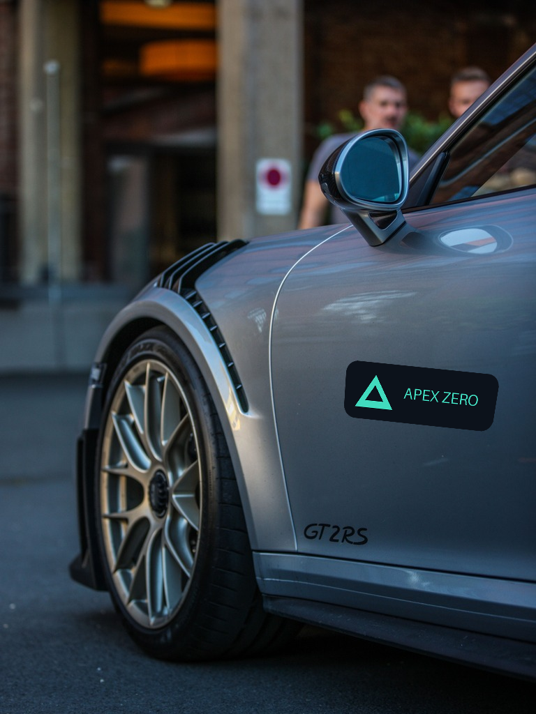
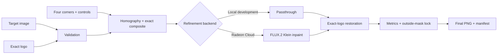

# Radeon SponsorSkin

Radeon SponsorSkin turns a target photograph and an exact SVG or transparent
PNG logo into an auditable sponsorship mockup while keeping brand geometry
outside the generative model.



> The image above uses a credited Pexels stock photograph and deterministic
> logo placement. It is not FLUX output and does not demonstrate Radeon
> performance.

## Track 1 fit

SponsorSkin is a multimodal content-creation tool with a complete
image-plus-logo input, placement, processing, comparison, evaluation, and
export workflow. Its differentiator is the separation of responsibilities:
computer vision owns the exact logo; masked FLUX.2 refinement owns only local
surface material, lighting, reflections, and texture.

The local development candidate is complete. Real FLUX.2 output, Radeon/ROCm
compatibility, latency, and peak VRAM remain pending access to the assigned
Radeon Cloud instance. No local macOS measurement is presented as GPU evidence.

## Implemented features

- JPEG, PNG, and WebP target validation with EXIF correction.
- Transparent PNG and safe SVG logo validation and rasterization.
- Four-click quadrilateral placement in any click order.
- Scale, rotation, opacity, mask-padding, and feather controls.
- Exact perspective warp, rough composite, exact alpha, and edit mask.
- Local passthrough and fail-closed Radeon FLUX.2 backend selection.
- Smooth illumination transfer onto the exact warped logo.
- Original, rough, model-only, and final comparison.
- Preservation, SSIM, color, sharpness, and mask metrics.
- Unique run directories with images, settings, environment, and manifest.
- Seven rights-documented stock-photo examples, three procedural regression
  fixtures, and an interactive Gradio UI.

## Architecture



See [the detailed architecture](docs/architecture.md) for module boundaries and
invariants.

## Local environment

The committed local evidence was captured with Python 3.12.13 on macOS arm64
(Apple M3 Pro), without PyTorch, ROCm, or an AMD GPU. The Conda environment is
named `radeon-sponsorskin`.

```bash
cd submissions/Track1-Radeon-SponsorSkin
mamba env update --file environment.yml --prune
conda activate radeon-sponsorskin
```

If the environment already exists:

```bash
python -m pip install -e ".[dev,docs,ui]"
```

Native Cairo is required for SVG logos. `environment.yml` installs it from
conda-forge.

## Start the interactive app

```bash
python app.py
```

Open `http://127.0.0.1:7860` and:

1. Upload a target and an authorized transparent logo.
2. Click four surface corners on the target.
3. Choose a material and adjust placement controls.
4. Build the deterministic preview and inspect the exact layer and mask.
5. Run the selected backend.
6. Compare original, rough, model-only, and restored final images.
7. Inspect metrics and download the final PNG and manifest.

The default local badge remains visible because passthrough mode does not
execute a model or GPU.

## Command-line workflows

Create only the deterministic composition artifacts:

```bash
python scripts/compose.py \
  --target demo_assets/real_inputs/porsche-911.jpg \
  --logo demo_assets/logos/apex-zero.png \
  --point 485,510 --point 730,535 --point 715,625 --point 480,600 \
  --material vinyl \
  --output runs/compose-example
```

Exercise the complete artifact contract with local passthrough:

```bash
python scripts/run_local.py \
  --target demo_assets/real_inputs/porsche-911.jpg \
  --logo demo_assets/logos/apex-zero.png \
  --point 485,510 --point 730,535 --point 715,625 --point 480,600 \
  --material vinyl --seed 42
```

Rebuild the seven real-world exact-logo previews:

```bash
python scripts/prepare_real_demo_assets.py --output demo_assets
```

Regenerate the three procedural regression fixtures:

```bash
python scripts/generate_demo_assets.py --output demo_assets --force
```

## Tests and local evidence

```bash
python -m pytest tests -q
ruff check .
ruff format --check .
python scripts/doctor.py --json benchmarks/local-environment.json
python scripts/benchmark.py --output benchmarks/local-results.json
```

Expected CPU-safe result at this revision: `36 passed`. The committed 1280 x
768 passthrough benchmark records an outside changed-pixel ratio of `0`, an
outside SSIM of `1`, and a warm mean of approximately `0.425 s`. That timing is
for the deterministic artifact path only—no generative model and no Radeon GPU
were used.

- [Local environment JSON](benchmarks/local-environment.json)
- [Local benchmark JSON](benchmarks/local-results.json)

## Radeon Cloud handoff

Keep the platform ROCm PyTorch build. Do not install or upgrade `torch` from
PyPI.

```bash
python -m pip install -e ".[dev,docs,ui]"
python -m pip install -r requirements-radeon.txt
python scripts/doctor.py --require-rocm \
  --json benchmarks/radeon-environment.json
```

Run one masked smoke test:

```bash
python scripts/smoke_flux.py \
  --target demo_assets/real_inputs/porsche-911.jpg \
  --logo demo_assets/logos/apex-zero.png \
  --point 485,510 --point 730,535 --point 715,625 --point 480,600 \
  --material vinyl --steps 4 --strength 0.65
```

Measure one cold process path and at least three warm runs:

```bash
python scripts/benchmark_flux.py \
  --target demo_assets/real_inputs/porsche-911.jpg \
  --logo demo_assets/logos/apex-zero.png \
  --point 485,510 --point 730,535 --point 715,625 --point 480,600 \
  --material vinyl --iterations 4 \
  --output benchmarks/radeon-results.json
```

After both gates pass, launch the same interface with the Radeon backend:

```bash
SPONSORSKIN_BACKEND=flux2 \
SPONSORSKIN_SERVER_NAME=0.0.0.0 \
python app.py
```

The backend lazily loads in BF16, refuses to run without `torch.version.hip`
and an accelerator, aligns dimensions for inference/restoration, and records
latency, peak allocated VRAM, GPU, ROCm, PyTorch, model, and dependency
provenance.

## Models and revisions

| Component | Identifier / revision | License | Status |
|---|---|---|---|
| Release inference | `black-forest-labs/FLUX.2-klein-4B` | Apache-2.0 | Backend implemented; Radeon execution pending |
| Diffusers source | `9e969b6cf0588fd75fbacee9a39d16a3f5c56fc4` | Apache-2.0 | Pinned in `requirements-radeon.txt` |
| Model weights | Exact Hugging Face revision | Apache-2.0 | Must be pinned after the first passing cloud smoke test |
| Local passthrough | No model | Project Apache-2.0 | Tested locally |

Model access may require accepting the terms on the
[Hugging Face model page](https://huggingface.co/black-forest-labs/FLUX.2-klein-4B)
and authenticating with `huggingface-cli login`. The model is downloaded at
first Radeon execution; weights are never committed.

## Run outputs

Every execution creates `runs/<UTC timestamp>-<random suffix>/`:

```text
manifest.json          original.png
logo_original.png      logo_layer.png
rough_composite.png    edit_mask.png
exact_alpha.png        refined.png
final.png              shading_map.png
metrics.json
```

`runs/` is ignored by Git. `manifest.json` contains placement settings, ordered
points, seed, app version, backend, model, environment, latency, and artifact
names.

## Dataset and LoRA status

The optional Sponsor Edit LoRA is not part of the release path and has not been
trained. The repository contains a trainer-independent canonical paired-data
schema, validator, rights requirements, a conservative Radeon pilot
configuration, and a held-out acceptance gate:

```bash
python scripts/validate_dataset.py path/to/canonical-dataset \
  --json benchmarks/dataset-validation.json
```

See [dataset methodology](docs/dataset-methodology.md). LoRA may enter a demo
only after a loadable Radeon-trained checkpoint improves held-out comparisons
without worsening preservation or logo fidelity.

## Real-world example set

| Surface | Original | Local exact-logo preview |
|---|---|---|
| Porsche 911 GT2 RS | [`real_inputs/porsche-911.jpg`](demo_assets/real_inputs/porsche-911.jpg) | [`real_previews/porsche-911`](demo_assets/real_previews/porsche-911/rough_composite.png) |
| City bus | [`real_inputs/city-bus.jpg`](demo_assets/real_inputs/city-bus.jpg) | [`real_previews/city-bus`](demo_assets/real_previews/city-bus/rough_composite.png) |
| Delivery truck | [`real_inputs/delivery-truck.jpg`](demo_assets/real_inputs/delivery-truck.jpg) | [`real_previews/delivery-truck`](demo_assets/real_previews/delivery-truck/rough_composite.png) |
| Blank hoodie | [`real_inputs/blank-hoodie.jpg`](demo_assets/real_inputs/blank-hoodie.jpg) | [`real_previews/blank-hoodie`](demo_assets/real_previews/blank-hoodie/rough_composite.png) |
| Cap | [`real_inputs/workshop-cap.jpg`](demo_assets/real_inputs/workshop-cap.jpg) | [`real_previews/workshop-cap`](demo_assets/real_previews/workshop-cap/rough_composite.png) |
| Street billboard | [`real_inputs/street-billboard.jpg`](demo_assets/real_inputs/street-billboard.jpg) | [`real_previews/street-billboard`](demo_assets/real_previews/street-billboard/rough_composite.png) |
| Bus shelter | [`real_inputs/bus-shelter.jpg`](demo_assets/real_inputs/bus-shelter.jpg) | [`real_previews/bus-shelter`](demo_assets/real_previews/bus-shelter/rough_composite.png) |

## Assets, licensing, and security

The code, procedural regression fixtures, and fictional NOVA GRID, APEX ZERO,
and KINETIQ wordmarks are [Apache-2.0](LICENSE). The seven stock photographs
remain under the Pexels License and are not relicensed by the project. See
[demo asset credits](demo_assets/CREDITS.md) for photographer and source links.

Do not commit credentials, model weights, cache directories, private
photographs, or logos without redistribution and derivative-use rights. The
SVG loader rejects scripts and external references.

## Submission artifacts

- [Project profile PDF](docs/project-profile.pdf)
- [Project profile source](docs/project-profile.md)
- [Poster PDF](docs/poster.pdf)
- [Editable standalone poster](docs/poster.svg)
- [Four-minute demo script](docs/demo-script.md)
- [Radeon Cloud evidence checklist](docs/cloud-evidence-checklist.md)
- Demo video: pending recording of the real Radeon execution path
- Radeon benchmark JSON: pending the real cloud benchmark

Rebuild and validate the PDFs and editable poster:

```bash
python scripts/build_submission_artifacts.py
```

The profile is eight A4 pages and the poster is one A3 landscape page.

## Known limitations

- Current local outputs are deterministic rough previews, not FLUX.2 results.
- Radeon model compatibility, visual improvement, latency, and VRAM are
  unverified until cloud execution.
- Exact model-weight revision remains intentionally unset.
- The LoRA path is a gated experiment, not a shipped capability.
- A real 3–5 minute Radeon demo video cannot be recorded locally.

The operational order and remaining evidence fields are in
[ROCm handoff notes](docs/rocm-notes.md) and the
[cloud checklist](docs/cloud-evidence-checklist.md).
