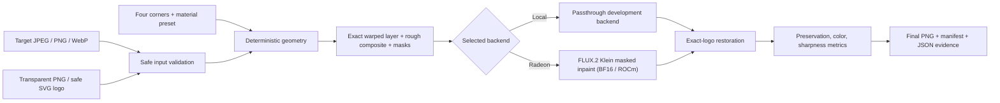

# System Architecture

Radeon SponsorSkin separates deterministic brand geometry from generative
surface integration. The model never owns the final logo shape.

## Responsibility boundaries

| Layer | Responsibility | Main modules |
|---|---|---|
| Validation | File limits, safe SVG, EXIF orientation, alpha checks | `validation.py` |
| Geometry | Point ordering, quadrilateral checks, perspective homography | `geometry.py` |
| Compositing | Logo preparation, RGBA warp, exact alpha, feathered edit mask | `compositing.py` |
| Refinement | Passthrough or lazy FLUX.2 Klein inpaint backend | `inference.py`, `prompts.py` |
| Restoration | Smooth illumination transfer to exact logo; outside-mask lock | `restoration.py` |
| Evaluation | Outside-mask preservation, SSIM, Delta E, sharpness, warnings | `evaluation.py` |
| Evidence | Versioned runs, manifests, environment and benchmark JSON | `pipeline.py`, `telemetry.py` |
| Interface | Uploads, four-click canvas, controls, comparisons, downloads | `ui.py`, `app.py` |

## Invariants

- Inputs are never overwritten.
- The undilated warped alpha is retained for exact restoration and metrics.
- White edit-mask pixels may change; black pixels are restored from the
  original.
- The passthrough backend is pixel-idempotent.
- The Radeon backend refuses to load when `torch.version.hip` or the device is
  absent.
- Every completed generation writes a unique run directory and manifest.
